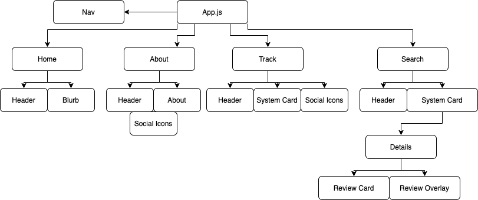

# every-metro Project Overview

## Project Name

Every Metro

Deployed Site using Netlify: [here](https://every-metro.netlify.app)

[EveryMetroInstagram](https://www.instagram.com/everymetrointheworld/)

## Project Description

A website for Every Metro in the World that uses the Every Metro Airtable API to display information about any Metro/subway system in the world. Users can see detailed information about specific metro systems and leave reviews or suggestions of things to do in those cities. Users can also track the cities that Every Metro has visited.

## Wireframes

Wireframes [here](https://www.figma.com/file/FoklhFDGZCxu9jVOKerQdj/Every-Metro-Wireframes)!!

## Component Hierarchy



## API and Data Sample

Using Every Metro Airtable API

This API, as it was created before attending GA, may need some fine tuning so titles will behave better with axios.

```javascript
{
createdTime: "2020-01-23T02:19:17.000Z"
{
Annual Ridership in Millions: "n/a"
City: "Jinan"
Country: "China"
Name: "Jinan Metro"
Region: "Asia"
Stations as of 01/2020: "23"
System Length as of 01/2020: "47.7 km (29.6 mi)"
Year Opened: "2019"
}
id: "rec1mRM5ocUOicW1u"
}

```

### MVP/PostMVP

#### MVP

- makes API call to get list of metros/cities ---tick---
- able to search for a specific system ---tick---
- users can see detailed information about different metro systems ---tick---
- users can leave reviews and suggestions for each metro system ---tick---
- conditionally render information if available ---tick---
- responsive styling and CSS

#### PostMVP

- users can contribute to the data via an input form
- incorporate visited table from API so users can see previos Every Metro trips
- incorporate light rail/trams table into all of the above
- linking between systems and their light rail systems / other systems in the same city

## Project Schedule

| Day         | Deliverable                                        | Status     |
| ----------- | -------------------------------------------------- | ---------- |
| December 3  | Prompt / Wireframes / Priority Matrix / Timeframes | Complete   |
| December 4  | Project Approval                                   | Complete   |
| December 6  | Core Application Structure (HTML, CSS, etc.)       | Complete   |
| December 7  | Pseudocode / actual code                           | Incomplete |
| December 8  | Initial Clickable Model                            | Incomplete |
| December 9  | MVP                                                | Incomplete |
| December 11 | Presentations                                      | Incomplete |

## Timeframes

| Component                      | Priority | Estimated Time | Time Invested | Actual Time |
| ------------------------------ | :------: | :------------: | :-----------: | :---------: |
| Wireframes and Pitch           |    H     |      2hrs      |     2hrs      |    2hrs     |
| Base React App                 |    H     |      2hrs      |     2hrs      |    0hrs     |
| Home Page                      |    H     |      2hrs      |     1hrs      |    0hrs     |
| Home Page Styling              |    H     |      2hrs      |    1.5hrs     |    0hrs     |
| Nav                            |    H     |      1hrs      |     1hrs      |    0hrs     |
| Nav Styling                    |    H     |      1hrs      |     3hrs      |    0hrs     |
| Search Page                    |    H     |      2hrs      |     2hrs      |    0hrs     |
| Search Functionality           |    H     |      2hrs      |     2hrs      |    0hrs     |
| Search Page Styling            |    H     |      2hrs      |     2hrs      |    0hrs     |
| System Card                    |    H     |      2hrs      |     1hrs      |    0hrs     |
| System Card Styling            |    H     |      1hrs      |    2.5hrs     |    0hrs     |
| System Details Page            |    H     |      3hrs      |     7hrs      |    0hrs     |
| System Details Styling         |    H     |      2hrs      |     2hrs      |    0hrs     |
| Reviews Components             |    H     |      2hrs      |     2hrs      |    0hrs     |
| Reviews Stylings               |    H     |      2hrs      |     2hrs      |    0hrs     |
| Add A review                   |    H     |      2hrs      |     2hrs      |    0hrs     |
| Responsive Styling             |    M     |      3hrs      |     1hrs      |    0hrs     |
| About Page                     |    M     |      1hrs      |     0hrs      |    0hrs     |
| About Page Styling             |    M     |      1hrs      |     0hrs      |    0hrs     |
| Tracking Page                  |    L     |      2hrs      |     0hrs      |    0hrs     |
| Tracking Page Styling          |    L     |      2hrs      |     0hrs      |    0hrs     |
| Incorporate Light Rail Systems |    L     |      3hrs      |     0hrs      |    0hrs     |
| Total                          |    H     |     42hrs      |     0hrs      |    0hrs     |

## SWOT Analysis

### Strengths:

Functionality, dealing with data, and making API calls

### Weaknesses:

CSS and styling

### Opportunities:

- Get to practice CSS
- Get to make something that I will definitely use in the future

### Threats:

- Database was not made with this in mind, so may experience some growing pains

## Code Snippet
